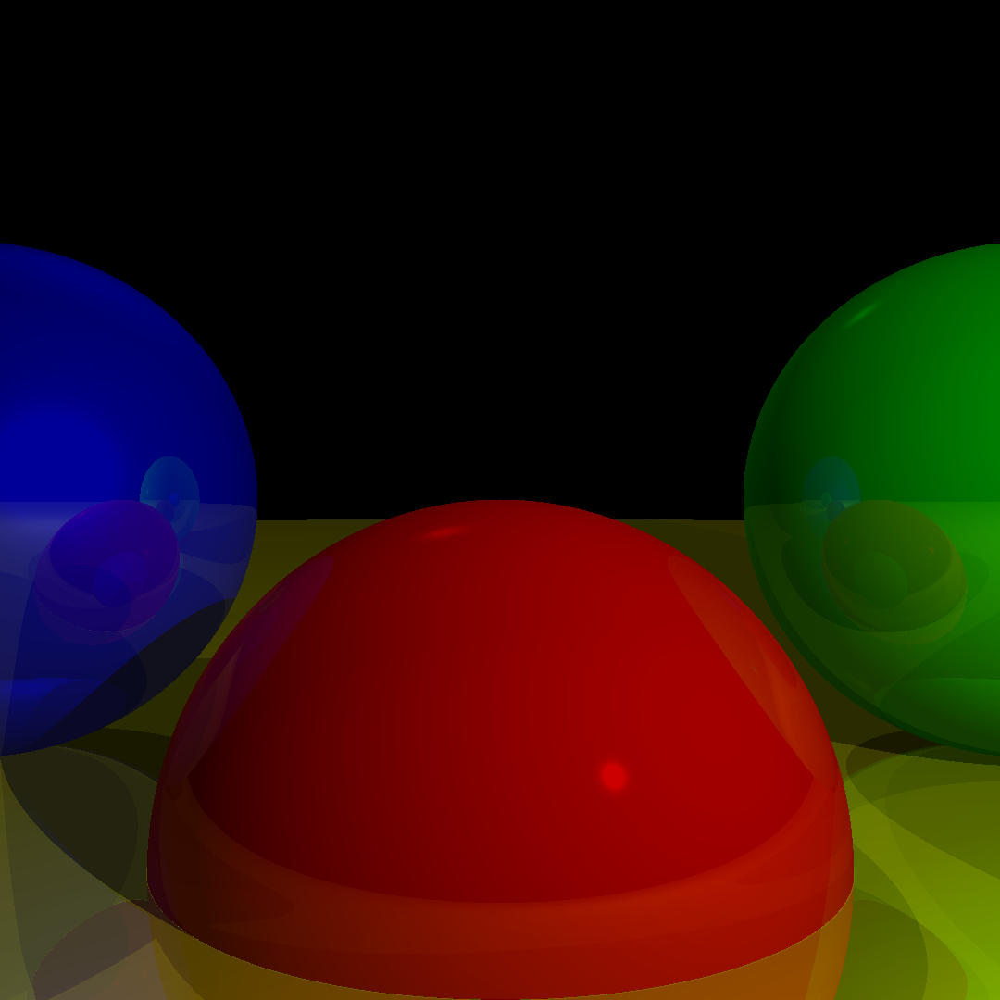

# Simple Raytracing Engine using C and SDL



A simple raytracing engine built in C with the help of the Simple DirectMedia Layer (SDL). This project is designed to help you explore the fundamentals of raytracing and create stunning rendered images through code.

## Acknowledgments

This project is a C implementations of the concepts discussed in **Gabriel Gambetta Computer Graphics from Scratch** book. I highly recommend reading this book if you are interested in learning more about the fundamentals of computer graphics and raytracing.

## Features

- [x] Window setup
- [x] Canvas and viewport
- [x] Ray-Sphere intersection equation
- [x] Sphere rendering
- [x] Point light
- [x] Directional light
- [x] Ambient light
- [x] Diffuse reflection
- [x] Specular reflection
- [x] Shadows
- [x] Reflection

## Performance Optimizations

### Arbitrary Camera Positioning
- [ ] Fix arbitrary camera positioning implementation

### Parallelization
- [ ] Investigate parallelization techniques to trace multiple rays simultaneously.
- [ ] Consider using worker threads and dividing the canvas into tasks to improve parallelization.

### Caching Immutable Values
- [ ] Identify expensive computations in your raytracer (e.g., dot products) that can be cached.
- [ ] Cache values such as `r * r`, `dot(OC, OC)`, and other immutable values.
- [ ] Reuse cached values where appropriate for performance benefits.

### Shadow Optimizations
- [ ] Implement shadow coherence to optimize shadow ray calculations.
- [ ] Prioritize intersecting with objects known to cast shadows on multiple nearby points.
- [ ] Return a Boolean value when finding any intersection to improve shadow checks.

### Spatial Structures
- [ ] Implement spatial data structures to efficiently discard non-intersecting objects.
- [ ] Use bounding spheres to quickly eliminate groups of objects.
- [ ] Consider hierarchical structures like bounding volume hierarchies for further optimization.

### Subsampling
- [ ] Explore subsampling techniques to reduce the number of primary ray-scene intersection computations.
- [ ] Skip some pixels to compute fewer rays, reducing computational load.
- [ ] Be aware that this optimization may result in a slightly different image.

### Supporting Other Primitives
- [ ] Extend your raytracer to support other primitives like triangles.
- [ ] Modify `TraceRay` to handle new primitives while keeping object-independence.

### Constructive Solid Geometry
- [ ] Implement constructive solid geometry (CSG) to represent complex objects using set operations (union, intersection, subtraction).
- [ ] Enable rendering of objects created by combining simpler shapes through CSG.

### Transparency
- [ ] Add support for partially transparent objects.
- [ ] Calculate local, reflected, and transmitted (refracted) colors based on the material properties.
- [ ] Implement refraction using Snell's Law and refraction indices.

### Refraction
- [ ] Extend your raytracer to account for refraction when rays pass through transparent objects.
- [ ] Implement Snell's Law to determine the new direction of the refracted ray.

### Supersampling
- [ ] Implement supersampling to improve image quality.
- [ ] Trace multiple rays per pixel and average their colors for smoother results.
- [ ] Apply pixel subdivision when necessary, based on object changes and color differences.

### Summary
- [ ] Reflect on the performance and capabilities of your raytracer, understanding the trade-offs between purity and real-time performance.
- [ ] Consider the need for different rendering techniques for applications like real-time graphics (e.g., rasterization) that require high frame rates.


## Getting Started

These instructions will help you get a copy of the project up and running on your local machine for development and testing purposes.

### Prerequisites

- C compiler (e.g., GCC)
- SDL2 library

### Installing

1. Clone the repository:

   ```bash
   git clone https://github.com/amine-maazizi/SimpleRaytracer-SDL.git
   cd SimpleRaytracer-SDL
   ```

2. Build the project:
    
   ```bash
   make
   ```

3. Run the raytracer example:

  ```bash
   ./raytracer
   ```

## Contributing

I welcome and appreciate contributions to the Doodle Dataset Generation project. Your contributions help improve the tool and make it more versatile for the community. Here's how you can contribute:

1. **Reporting Issues**: If you encounter any bugs, issues, or unexpected behavior while using the tool, please report them.

2. **Suggesting Features**: If you have ideas for new features or improvements to the tool, you can suggest them.

3. **Pull Requests**: If you'd like to contribute code or fix issues yourself, you can submit pull requests on GitHub. Please make sure to follow these guidelines:
    - Fork the repository to your GitHub account.
    - Create a new branch for your changes.
    - Commit your changes and provide a clear and concise description.
    - Push your branch to your fork.
    - Create a pull request to the original repository.

I appreciate your involvement in making the Doodle Dataset Generation tool better. Your contributions help us enhance its functionality and usability.

## License

This project is licensed under the [MIT License](https://opensource.org/licenses/MIT). You are free to use, modify, and distribute this software as long as you include the original license in your distribution.


## Author

This project is created and maintained by MAAZIZI Amine. You can reach out to me through the following contact information:

- Email: Aminema1000@gmail.com
- GitHub: [GitHub Profile](https://github.com/amine-maazizi)
- LinkedIn: [LinkedIn Profile](https://www.linkedin.com/in/amine-maazizi-190266235/)

Feel free to contact me if you have any questions, suggestions, or feedback related to the project.


